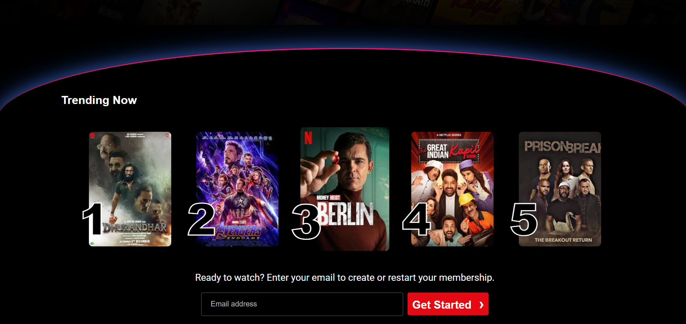
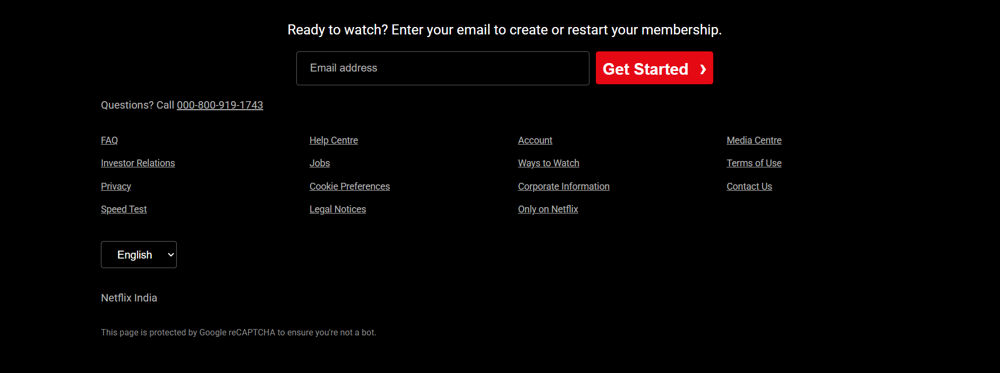

# Netflix-LandingPage-Clone
A responsive Netflix landing page clone built using HTML, CSS, and JavaScript, replicating the modern Netflix homepage UI and user experience.
# 🎬 Netflix Landing Page Clone

A responsive Netflix Landing Page Clone built using **HTML, CSS, and JavaScript**. This project recreates the look and feel of Netflix's official landing page, featuring a modern UI, responsive design, and smooth user experience.

## 🚀 Live Demo

Add your deployed website link here:

```text
https://your-live-demo-link.com
```

## 📸 Screenshots

### Homepage


### Features Section



### FAQ Section



## ✨ Features

* Responsive design for Desktop, Tablet, and Mobile
* Netflix-inspired user interface
* Hero section with call-to-action
* Interactive FAQ section
* Clean and modern layout
* Optimized styling using CSS
* Beginner-friendly project structure

## 🛠️ Built With

* HTML5
* CSS3
* JavaScript

## 📂 Project Structure

```text
Netflix-LandingPage-Clone/
│
├── index.html
├── style.css
├── script.js
├── assets/
│   └── screenshots/
│       ├── homepage.png
│       ├── features.png
│       └── faq.png
└── README.md
```

## ⚙️ Installation

1. Clone the repository

```bash
git clone https://github.com/Arpit-Singh-Chauhan/Netflix-LandingPage-Clone.git
```

2. Navigate to the project folder

```bash
cd Netflix-LandingPage-Clone
```

3. Open `index.html` in your browser.

## 🎯 What I Learned

* Responsive Web Design
* CSS Flexbox & Grid
* Modern Landing Page Layouts
* JavaScript DOM Manipulation
* Frontend Development Best Practices

## 🤝 Contributing

Contributions, issues, and feature requests are welcome.

## 📜 License

This project is created for educational purposes only.

Netflix is a trademark of Netflix, Inc. This project is not affiliated with, endorsed by, or connected to Netflix in any way.

## 👨‍💻 Author

**Arpit Singh Chauhan**

GitHub: https://github.com/Arpit-Singh-Chauhan
